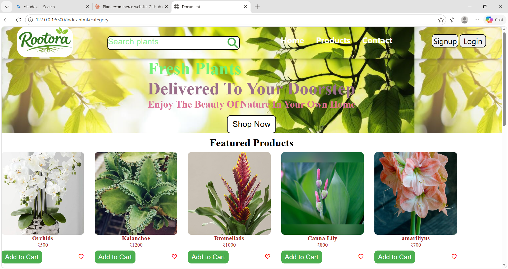

# 🌿 PlantShop — Plant Products Ecommerce Website

> A clean, responsive ecommerce platform built exclusively for plant lovers. Browse and purchase a wide variety of indoor and outdoor plants — all from the comfort of your home.

---

## 📸 Preview

<!-- Add a screenshot of your project here -->


---

## 🌟 Features

- 🌱 Browse a curated collection of plants (indoor & outdoor)
- 🔍 Search and filter plants by category or name
- 🛒 Add to cart and manage your selections
- 📄 Detailed plant pages with descriptions and pricing
- 👤 User authentication — Sign up & Login
- 📱 Fully responsive design for all screen sizes
- ☁️ Real-time data storage powered by Supabase

---

## 🛠️ Tech Stack

| Technology | Purpose |
|------------|---------|
| **HTML5** | Page structure and markup |
| **CSS3** | Styling and responsive layout |
| **JavaScript (ES6+)** | Interactivity and dynamic content |
| **Supabase** | Backend-as-a-Service (Database, Auth, API) |

---

## 📁 Project Structure

```
plantshop/
├── index.html          # Home page
├── products.html       # Plant listing page
├── product-detail.html # Individual plant detail page
├── cart.html           # Shopping cart
├── login.html          # Login / Signup page
├── css/
│   └── style.css       # Main stylesheet
├── js/
│   ├── main.js         # Core logic
│   ├── auth.js         # Supabase authentication
│   ├── cart.js         # Cart functionality
│   └── supabase.js     # Supabase client setup
└── assets/
    └── images/         # Plant images and assets
```

---

## ⚙️ Getting Started

### Prerequisites

- A modern web browser
- A [Supabase](https://supabase.com) account (free tier works)

### 1. Clone the Repository

```bash
git clone https://github.com/Kavya-mukthapuram/Ecommerce-Website.git
cd Ecommerce-Website
```

### 2. Set Up Supabase

1. Go to [https://supabase.com](https://supabase.com) and create a new project
2. Create a `plants` table with the following columns:

| Column | Type |
|--------|------|
| id | int8 (Primary Key) |
| name | text |

3. Enable **Row Level Security (RLS)** as needed
4. Copy your **Project URL** and **Anon Key** from Project Settings → API

### 3. Configure Supabase Credentials

In your `js/supabase.js` file, replace with your credentials:

```javascript
import { createClient } from 'https://cdn.jsdelivr.net/npm/@supabase/supabase-js/+esm'

const SUPABASE_URL = 'your-project-url'
const SUPABASE_ANON_KEY = 'your-anon-key'

export const supabase = createClient(SUPABASE_URL, SUPABASE_ANON_KEY)
```

### 4. Run the Project

Since this is a frontend-only project, simply open `index.html` in your browser:

```bash
# Option 1: Open directly
open index.html

# Option 2: Use VS Code Live Server extension (recommended)
# Right-click index.html → Open with Live Server
```

---

## 🔐 Authentication

User authentication is handled via **Supabase Auth**:
- Email & Password Sign Up
- Login with existing account
- Session persistence across pages
- Protected routes for cart and checkout

---

## 🗄️ Database

All plant data and user orders are stored and managed in **Supabase**:
- Real-time data fetching for plant listings
- Secure user data management via Supabase Row Level Security
- Cart and order data stored per authenticated user

---

## 📦 Deployment

You can deploy this project easily on any static hosting platform:

### Netlify
- Drag and drop your project folder at [netlify.com/drop](https://ecommerce-website-plant.netlify.app/)

### GitHub Pages
- Go to Repository Settings → Pages → Select branch `main` → Save

---

## 🤝 Contributing

Contributions are welcome! Feel free to:

1. Fork the repository
2. Create a feature branch 
3. Commit your changes 
4. Push to the branch 
5. Open a Pull Request

---

## 📄 License

This project is licensed under the [MIT License](./LICENSE).

---

## 👤 Author

**Your Name**
- GitHub: [@your-username](https://github.com/your-Kavya-mukthapuram)
- LinkedIn: [your-linkedin](https://linkedin.com/in/your-profile)

---

> 🌱 *"Plants bring life to every space — and now, to your doorstep."*
